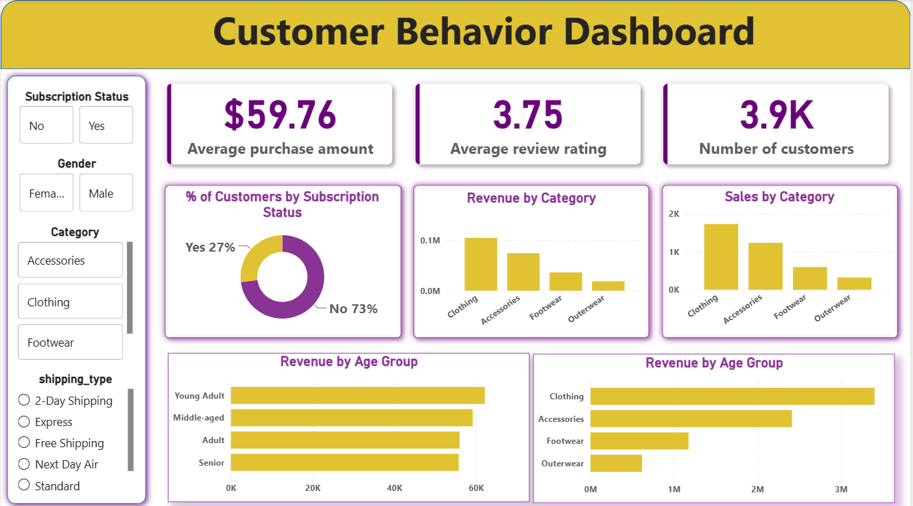

<div align="center">

# 🛍️ Customer Shopping Behavior Analysis

### End-to-End Data Analytics Project using Python, SQL & Power BI


---

**An end-to-end retail analytics project that transforms raw customer shopping data into actionable business insights through data preprocessing, SQL-based analysis, and an interactive Power BI dashboard.**

</div>
---

# 📊 Dashboard Preview

<p align="center">
  
</p>

---

# 📁 Repository Navigation

| Resource                                                                      | Description                                                                                        |
| ----------------------------------------------------------------------------- | -------------------------------------------------------------------------------------------------- |
| 📓 **[Python Notebook](Notebooks/Customer_Shopping_Behavior_Analysis.ipynb)** | Data loading, preprocessing, feature engineering, exploratory data analysis and MySQL integration. |
| 🗄️ **[SQL Analysis](Sql/customer_behavior.sql)**                             | Business-focused SQL queries including aggregations, CTEs, CASE statements and window functions.   |
| 📊 **[Power BI Dashboard](Powerbi/dashboard.pbix)**                           | Interactive dashboard for customer behavior and sales analysis.                                    |
| 📁 **[Dataset](Data/customer_shopping_behavior.csv)**                         | Retail customer shopping dataset used throughout the project.                                      |

---

# 📖 Overview

This project demonstrates an end-to-end data analytics workflow using **Python, SQL, and Power BI** to analyze retail customer shopping behavior. Starting from raw transaction data, the project focuses on data cleaning, feature engineering, business analysis, and interactive dashboard development.

The analysis explores customer demographics, purchasing behavior, product performance, subscriptions, discounts, shipping preferences, and customer loyalty to generate actionable business insights for retail decision-making.

---

# 🎯 Business Objectives

* Clean and prepare raw retail transaction data for analysis.
* Perform feature engineering to improve analytical capabilities.
* Analyze customer purchasing behavior using SQL.
* Identify sales trends across product categories and demographics.
* Compare subscriber and non-subscriber purchasing patterns.
* Evaluate the impact of discounts on customer spending.
* Build an interactive dashboard for business decision-making.

# 🔄 End-to-End Analytics Workflow

```text
                     Raw Customer Shopping Dataset
                                   │
                                   ▼
                        🐍 Python (Pandas)
          ───────────────────────────────────────────
          • Data Loading
          • Data Quality Assessment
          • Missing Value Imputation
          • Column Standardization (snake_case)
          • Feature Engineering
          • Exploratory Data Analysis (EDA)
                                   │
                                   ▼
                               SQL Analysis
          ───────────────────────────────────────────
          • Business Queries
          • Aggregations
          • CASE Statements
          • CTEs
          • Window Functions
          • Customer Segmentation
                                   │
                                   ▼
                         📊 Power BI Dashboard
          ───────────────────────────────────────────
          • KPI Cards
          • Interactive Filters
          • Revenue Analysis
          • Customer Insights
          • Category Performance
          • Executive Dashboard

---

# ⚙️ Data Preprocessing

The dataset was cleaned and prepared for analysis using Python and Pandas through the following steps:

- Assessed data quality and identified missing values.
- Imputed missing **Review Ratings** using the median value within each product category.
- Standardized column names using `snake_case`.
- Engineered new features including **Age Group** and **Purchase Frequency (Days)**.
- Validated relationships between discount and promotional fields before analysis.

# 🗄️ SQL Business Analysis

Business-focused SQL queries were used to transform the cleaned dataset into actionable insights for retail decision-making.

### Business Questions Answered

* Which product categories generate the highest revenue?
* Which customer segments contribute the most sales?
* Do subscribers spend more than non-subscribers?
* How effective are discounts in driving purchases?
* Which shipping methods are most preferred?
* Which products receive the highest customer ratings?
* Which age groups contribute the highest revenue?
* Which customers are New, Returning, or Loyal?
* Which products rank highest within each category?

The analysis was implemented using **aggregate functions, CASE statements, Common Table Expressions (CTEs), subqueries, and window functions** to answer these business questions efficiently.

# 📊 Interactive Dashboard

The Power BI dashboard provides an interactive view of customer shopping behavior through KPIs, filters, and business-focused visualizations.

### Features

- KPI cards for Total Customers, Average Purchase Amount, and Average Review Rating.
- Interactive filters for Gender, Category, Subscription Status, and Shipping Type.
- Revenue analysis by Product Category and Age Group.
- Sales distribution across product categories.
- Customer subscription analysis.

# 📂 Repository Structure

```text
customer_behavior_analysis
│
├── Data/
│   └── customer_shopping_behavior.csv
│
├── Notebooks/
│   └── Customer_Shopping_Behavior_Analysis.ipynb
│
├── Sql/
│   └── customer_behavior.sql
│
├── Powerbi/
│   └── dashboard.pbix
│
└── images/
    └── dashboard.png
```
